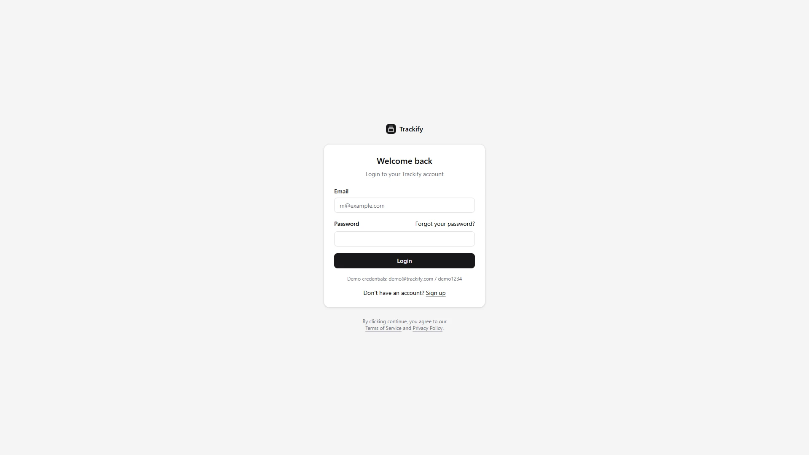
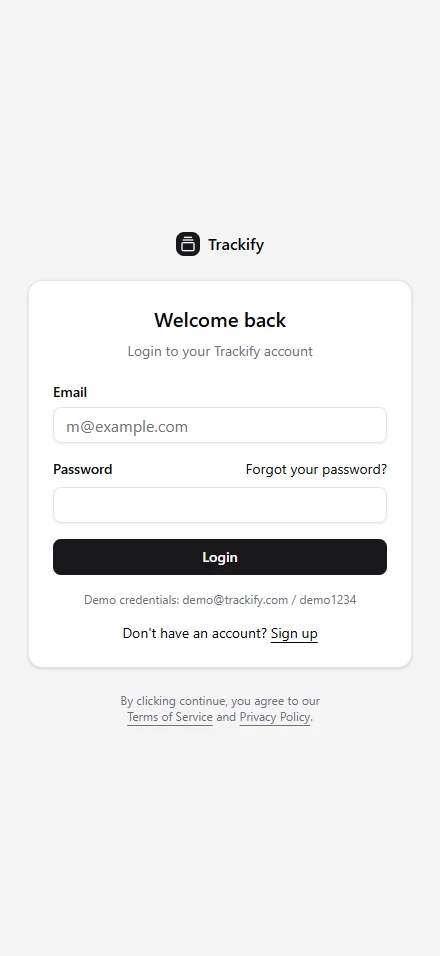
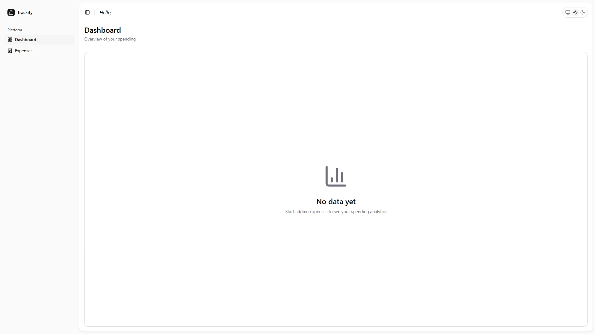
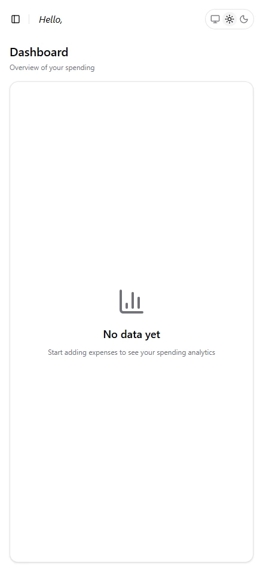
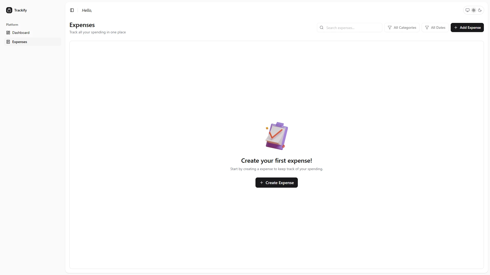
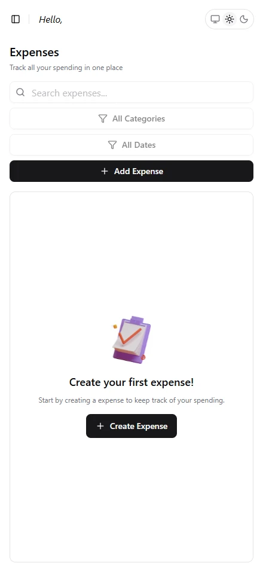

# 📌 Trackify — Personal Expense Tracker

A modern, feature-rich personal expense tracking application built with React, TypeScript, and Shadcn UI. Trackify helps you manage your finances by tracking expenses, visualizing spending patterns, and providing detailed analytics — all stored locally in your browser.

## 🚀 Live Demo

[**View Live Demo**](https://trackify-tawny.vercel.app/) • [**Watch Demo Video**](https://www.loom.com/share/5fc5b627bfbf4df9a3b7ab2580d310e3)

## 📥 How to Run the Project

### Prerequisites

- Node.js (v18 or higher)
- pnpm (recommended package manager)

### Installation & Setup

```bash
# Clone the repository
git clone https://github.com/shailxD/trackify.git

# Navigate to project directory
cd trackify

# Install dependencies
pnpm install

# Start development server
pnpm dev
```

The application will be available at `http://localhost:3000`

### Other Available Scripts

```bash
pnpm build        # Build for production
pnpm serve        # Preview production build
pnpm preview      # Build and preview production build
pnpm lint         # Run ESLint
pnpm check-types  # Check TypeScript types
pnpm format:check # Check code formatting
pnpm format:write # Format code with Prettier
pnpm test         # Run tests
pnpm capture      # Capture screenshots (requires Puppeteer setup)
```

### Data Persistence

Trackify uses **LocalStorage** for data persistence, meaning your expense data is stored directly in your browser. No backend or database setup is required.

## 🛠 Tech Stack

### Core Technologies

- **React 19** - UI library
- **Vite** - Build tool and dev server
- **TypeScript** - Type-safe JavaScript

### State Management

- **Zustand** - Lightweight state management

### Routing

- **TanStack Router** - Type-safe routing with file-based routing

### UI & Styling

- **Shadcn UI** - High-quality, accessible component library
- **Tailwind CSS** - Utility-first CSS framework
- **Radix UI** - Unstyled, accessible UI primitives
- **Lucide React** - Beautiful icon library

### Forms & Validation

- **React Hook Form** - Performant form management
- **Zod** - TypeScript-first schema validation

### Charts & Visualization

- **Recharts** - Composable charting library
- **Shadcn Charts** - Beautiful chart components

### Date Handling

- **date-fns** - Modern date utility library
- **React Day Picker** - Date picker component

## 📊 Screenshots

### Home

|                              Desktop                               |                              Mobile                              |
| :----------------------------------------------------------------: | :--------------------------------------------------------------: |
|  |  |

### Dashboard

|                                   Desktop                                    |                                   Mobile                                   |
| :--------------------------------------------------------------------------: | :------------------------------------------------------------------------: |
|  |  |

### Expenses

|                                  Desktop                                   |                                  Mobile                                  |
| :------------------------------------------------------------------------: | :----------------------------------------------------------------------: |
|  |  |

## 📁 Folder Structure

```
trackify/
├── public/
│   ├── manifest.json
│   ├── robots.txt
│   └── screenshots/         # Generated screenshots
├── src/
│   ├── assets/              # Images and static assets
│   ├── components/
│   │   ├── auth/            # Authentication components
│   │   │   ├── auth-container.tsx
│   │   │   ├── login-form.tsx
│   │   │   └── signup-form.tsx
│   │   ├── dashboard/       # Dashboard-specific components
│   │   │   ├── category-bar-chart.tsx
│   │   │   ├── dashboard-empty-state.tsx
│   │   │   ├── dashboard-header.tsx
│   │   │   └── spending-chart.tsx
│   │   ├── expenses/        # Expense management components
│   │   │   ├── Table/
│   │   │   │   ├── empty-state.tsx
│   │   │   │   ├── table-content.tsx
│   │   │   │   └── table-pagination.tsx
│   │   │   ├── delete-expense-dialog.tsx
│   │   │   ├── expense-form.tsx
│   │   │   ├── expense-header.tsx
│   │   │   └── expense-table.tsx
│   │   ├── layout/          # Layout components
│   │   │   ├── app-sidebar.tsx
│   │   │   ├── nav-main.tsx
│   │   │   └── nav-user.tsx
│   │   ├── theme-switcher/  # Theme toggle
│   │   ├── ui/              # Shadcn UI components
│   │   ├── error-component.tsx # Global error boundary
│   │   ├── loading.tsx      # Global loading state
│   │   ├── not-found.tsx    # 404 page
│   │   ├── route-guards.tsx
│   │   └── theme-provider.tsx
│   ├── data/
│   │   └── app.ts           # App configuration
│   ├── hooks/
│   │   ├── use-debounce.ts  # Custom hooks
│   │   └── use-mobile.ts
│   ├── lib/
│   │   ├── get-initials.ts  # Utility functions
│   │   └── utils.ts
│   ├── routes/              # TanStack Router file-based routes
│   │   ├── __root.tsx
│   │   ├── _app.tsx
│   │   ├── _auth.tsx
│   │   ├── index.tsx
│   │   ├── _app/
│   │   │   ├── dashboard.tsx
│   │   │   └── expenses.tsx
│   │   └── _auth/
│   │       ├── login.tsx
│   │       └── signup.tsx
│   ├── scripts/             # Automation scripts
│   │   └── capture.mts      # Screenshot capture script
│   ├── store/               # Zustand state management
│   │   ├── auth-store.ts
│   │   ├── expenses-store.ts
│   │   └── expenses-ui-store.ts
│   ├── types/
│   │   └── expenses.ts      # TypeScript type definitions
│   ├── main.tsx             # App entry point
│   ├── routeTree.gen.ts     # Auto-generated route tree
│   └── styles.css           # Global styles
├── .github/
│   └── copilot-instructions.md
├── components.json          # Shadcn UI configuration
├── eslint.config.js
├── package.json
├── prettier.config.js
├── tsconfig.json
├── vite.config.ts
└── README.md
```

## 🎯 Key Implementation Highlights

### State Management Architecture

- **Zustand Stores** - Three separate stores for clean separation of concerns:
  - `auth-store` - User authentication state
  - `expenses-store` - Expense data with CRUD operations
  - `expenses-ui-store` - UI state for dialogs, filters, and pagination

### Type Safety

- **End-to-end TypeScript** - Full type coverage across the application
- **Zod Schemas** - Runtime validation matching TypeScript types
- **Type-safe Routing** - TanStack Router provides full type safety for routes

### Component Organization

- **Feature-based Structure** - Components organized by feature (auth, dashboard, expenses)
- **Reusable UI Components** - Shadcn UI components extended with custom logic
- **Separation of Concerns** - Business logic in stores, presentation in components

## 📝 License

This project is open source and available under the [MIT License](LICENSE).

---

<div align="center">

Made with ❤️ by [shailxD](https://github.com/shailxD)

**[⬆ Back to Top](#-trackify--personal-expense-tracker)**

</div>
